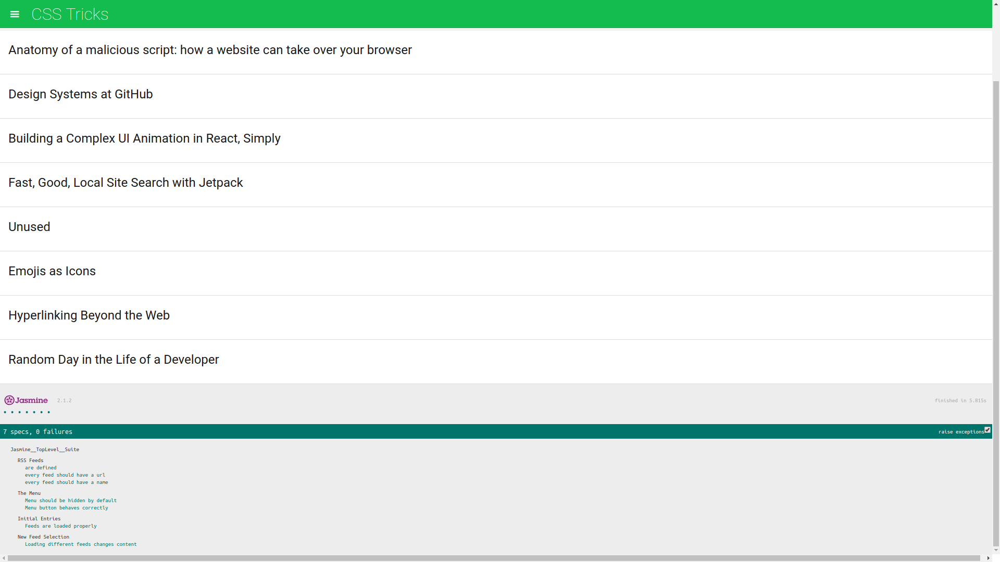

# Udacity Feed Reader Testing Project

## [Online Demo](https://jatindhankhar.in/frontend-nanodegree-feedreader)

## How to Run
Either open the `index.html` in your browser or visit the [Online Demo](https://jatindhankhar.in/frontend-nanodegree-feedreader)

## What I learned 
Running tests in browsers by using `Jasmine` 

## Tests Covered

### 1. RSS Feeds
        * All feeds are defined
        * Every feed has a non empty name
        * Every feed has a non empty url

### 2. The Menu
       * Menu is hidden by default
       * Menu button behaves correctly

### 3. Initial Entries
       * Feeds are loaded properly

### 4. New Feed Selection
        * Loading different feeds changes content